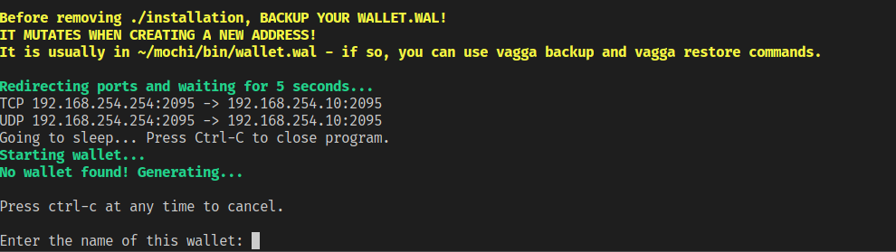

# Mochimo client in a container

Automatically:

- downloads Ubuntu 16.04 cloudimg and `build-essential`
- downloads and compiles Mochimo client
- downloads [MochiToolkit](https://github.com/chrisdigity/mochitoolkit)
- downloads and runs [portforwarder-rs](https://github.com/pzmarzly/portforwarder-rs) for automatic port redirection when possible
- generates new `wallet.dat`
- runs `wallet` with hardcoded peer address for faster connection

## Installation

Install [Vagga](https://vagga.readthedocs.io/en/latest/installation.html), then download this repo and run commands.

500MB of space is required for normal installation, 1.5GB if you also build portforwarder-rs from scratch (after installation and cleanup container takes 1GB).

## Commands

- `vagga shell` - run `bash` in the container
- `vagga wallet` - run Mochimo `wallet` binary
- `vagga wallet-pf` - try to forward ports and run `wallet`. AMD64 only
- `vagga wallet-pf-native` - build portforwarder-rs from scratch, then run `wallet-pf`
- `vagga backup` - copy `wallet.wal` from `installation` to main directory (where README is)
- `vagga restore` - copy `wallet.wal` from main directory (where README is) to `installation`

All commands will install their required dependencies on first run.

If you want to use existing `wallet.wal`, run `vagga wallet`, then Ctrl+C on `Enter the name of this wallet:` (generating new wallet), put your `wallet.wal` in the root directory (where README is), run `vagga restore`, then `vagga wallet-pf` (or `wallet` or `wallet-pf-native`).

## Tips

As of September 16, 2018, here are some known issues with `wallet` and their workarounds:

- `Network status` doesn't update - use `Menu 2 -> Get a Mochimo peer list` to update it
- `Display` doesn't show address if it has no funds - use `Menu 2 -> Display change addresses`
- `wallet` first asks for password, then checks if file even exists - shouldn't be a problem with `vagga wallet` script
- `Menu 2 -> Edit address name` displays index from 1 to 0 (incorrect) when there are no addresses, but always fails without corrupting files, so it's just a cosmetic issue